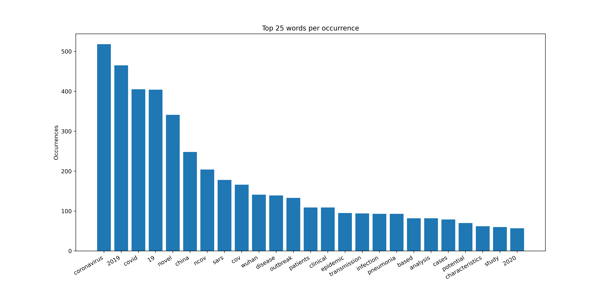

Now we know the title is the only data available for all papers, we are interested in looking at what words are the 
most common in all these titles (after removing stopwords):

We can see that the most common words that appear in almost half of the titles are words that are directly linked to 
`coronavirus`. Since we already know all papers are about this specific topic, we are going to remove them from our 
dictionary for clustering titles into similar group, as these words are not likely to help us discriminate between 
different groups.
